# Google Compute Engine (GCE)

## 📌 What is Compute Engine?

**Google Compute Engine (GCE)** is an Infrastructure-as-a-Service (IaaS) offering from
Google Cloud Platform.

It allows you to create and manage **Virtual Machines (VMs)** on Google’s global infrastructure.

With
Google Compute Engine,
you get full control over:

* Operating system
* CPU & Memory configuration
* Storage
* Networking
* Security policies
* Scaling behavior

It is similar to AWS EC2 in concept.

---

# 🚀 Key Features of Compute Engine

## 1️⃣ Virtual Machines (VMs)

* Linux and Windows support
* Predefined and custom machine types
* GPU & high-memory instances


## 2️⃣ Custom Machine Types

* Choose exact vCPU and RAM
* Optimize cost
* Avoid overprovisioning

| Machine | Best For        | Cost   | Performance |
| ------- | --------------- | ------ | ----------- |
| E2      | Dev, small apps | Low    | Moderate    |
| N2      | Production APIs | Medium | High        |
| C2      | CPU heavy apps  | High   | Very High   |

---

## 3️⃣ Persistent Storage

* Standard persistent disk
* SSD persistent disk
* Local SSD (high performance)
* Snapshots & backups

---

## 4️⃣ Managed Instance Groups (MIG)

* Auto scaling
* Auto healing
* Rolling updates
* Multi-zone deployment

---

## 5️⃣ Load Balancing

Using
Cloud Load Balancing

* Distributes traffic across instances
* Global Anycast IP
* SSL termination
* Health checks

---

## 6️⃣ Startup Scripts & Automation

* Automatically install software during VM boot
* Infrastructure automation
* Reproducible environments

---

## 7️⃣ Custom Images

* Faster VM startup
* Preconfigured application environments
* Production-grade scaling

---

## 8️⃣ Security Features

* IAM roles & service accounts
* Shielded VMs
* VPC firewall rules
* Integration with
  Cloud Armor for DDoS protection

---

## 9️⃣ Cost Optimization

* Sustained use discounts
* Committed use discounts
* Spot VMs (low-cost compute)
* Custom machine types

---

# 🛠 How to Use Compute Engine

## Step 1: Create a VM

1. Go to GCP Console
2. Navigate to Compute Engine → VM Instances
3. Click “Create Instance”
4. Select:

   * Machine type
   * Region & Zone
   * OS image
   * Firewall rules

---

## Step 2: Install Application (Example – NGINX)

```bash
sudo apt update
sudo apt install nginx -y
sudo systemctl start nginx
```

Access:

```
http://EXTERNAL_IP
```

---

## Step 3: Production Setup

For production-grade systems:

* Use Instance Templates
* Create Managed Instance Group
* Configure Autoscaling
* Attach Load Balancer
* Enable Health Checks
* Use HTTPS

---

# 📊 When to Use Compute Engine

Use Compute Engine when:

✅ You need full OS-level control
✅ Running legacy applications
✅ Migrating on-prem workloads
✅ Custom networking is required
✅ High-performance computing is needed
✅ Stateful applications require fine tuning

---

# ❌ When NOT to Use Compute Engine

Avoid Compute Engine if:

❌ You want fully managed serverless apps → Use Cloud Run
❌ You want container orchestration → Use GKE
❌ You want simple PaaS → Use App Engine

---

# 🏗 Real-World Use Cases

* Hosting FastAPI / Django backend
* Running enterprise ERP systems
* ML workloads with GPU
* Batch processing jobs
* Hybrid cloud migrations
* Multi-tier web applications

---

# 🧠 Architecture Example

```
Users
   ↓
Global Load Balancer
   ↓
Managed Instance Group (Multi-Zone)
   ↓
Compute Engine VMs
   ↓
Database (Cloud SQL)
```

---

# 🔥 Advantages

* Full flexibility
* High scalability
* Enterprise-grade infrastructure
* Global availability
* Strong integration with other GCP services

---

# ⚠ Considerations

* Requires infrastructure management
* Needs monitoring & scaling configuration
* Security must be properly configured
* Not fully serverless

---

# 📌 Summary

Google Compute Engine provides powerful, flexible, and scalable virtual machines on Google Cloud infrastructure.

It is best suited for:

* Custom applications
* Migration workloads
* Production systems needing full control

When designed with:

* Managed Instance Groups
* Load Balancing
* Autoscaling
* Security best practices

It becomes a highly available and enterprise-ready solution.


Perfect 👍
Now we move into **hands-on Architect-style task scenarios**.

We’ll continue one evolving system:

> 🛒 **CloudCart API (FastAPI/Django)**
> App VM(s) + Nginx + Separate DB VM
> Then evolve into Template → MIG → Load Balancer → HA → Production-ready

Each level:

* Clear objective
* Real-world scenario
* What to build
* Why architecturally
* Expected outcome

---

# 🟢 LEVEL 1 — BASIC (Single VM Architecture)

## 🔹 Task 1: Create a VM and Setup Nginx (Manual Setup)

🔹 Step 1: Create a Virtual Machine (VM) in GCP


Navigate to:
☰ Menu → Compute Engine → VM instances

Click Create Instance

Configure the VM:

Name: fual-finder

Region/Zone: Choose your preferred location (asia-south1-a (Mumbai))
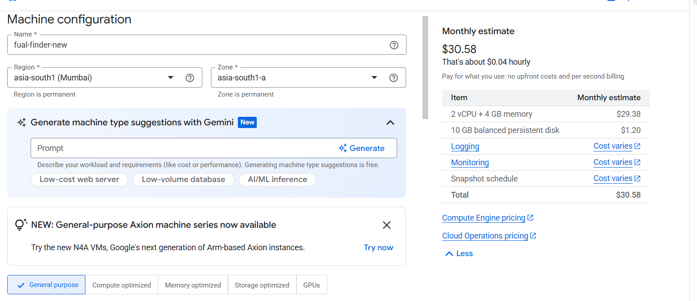

Machine Type: e2-micro (Free tier eligible)

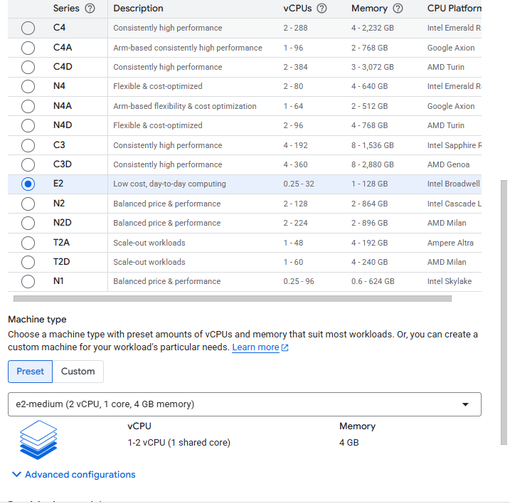
Boot Disk:

Click Change

Select Ubuntu 22.04 LTS

Size: 10 GB (default is fine)

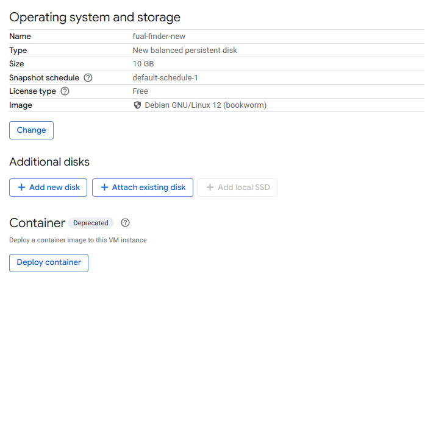

Under Firewall, check:

✅ Allow HTTP traffic

(Optional) ✅ Allow HTTPS traffic

Click Create
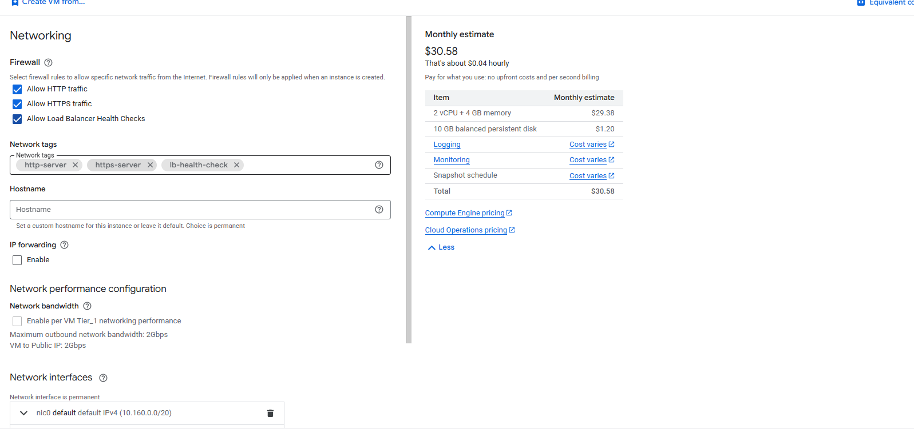
⏳ Wait for the VM to start.

🔹 Step 2: Connect to the VM

Once the VM status shows Running:
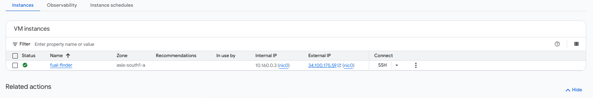

Click SSH next to your VM instance & Connect 

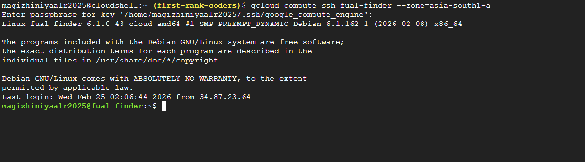

🔹 Step 3: Update the System

Run:
```base
      sudo apt update
      sudo apt upgrade -y
```
🔹 Step 4: Install Nginx

Run:
```base
   sudo apt install nginx -y
```
🔹 Step 5: Start and Enable Nginx
```base
   sudo systemctl start nginx
   sudo systemctl enable nginx
```

Check status:
```base
   sudo systemctl status nginx
```

You should see:

Active: active (running)

Open browser and visit:

http://YOUR_EXTERNAL_IP

You should see:

🎉 Welcome to nginx! page

open /var/www/html

Create index.html
```base
   sudo nano index.html
```
Add Below content and Save

 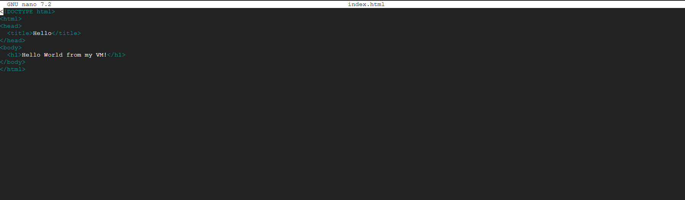

Open http://YOUR_EXTERNAL_IP

You can see like below

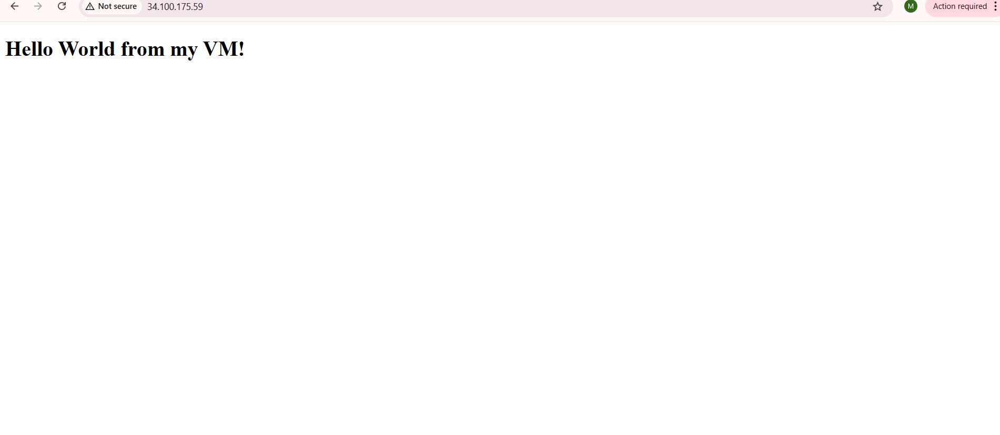


---
# 🟢 LEVEL 2 — Intermidate (Create VM with Self Script)
---

Follow the Same like Basic setup upto Firewall setup then 


Click Advance Add Automation Script like below 
```
apt update -y
apt upgrade -y
apt install -y nginx
systemctl start nginx
systemctl enable nginx
echo "<h1>VM Created with Startup Script</h1>" > /var/www/html/index.html
```

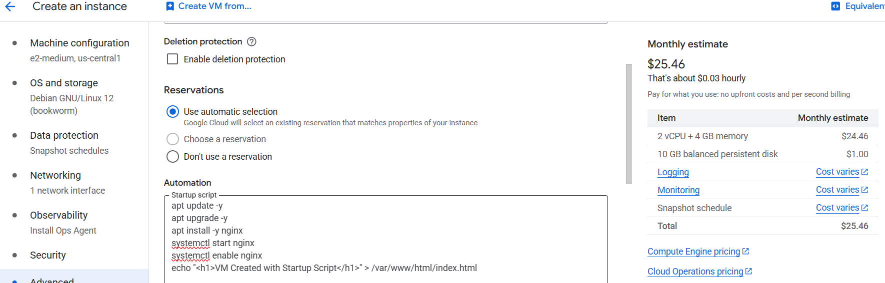

Click Create

Verify 
Open http://YOUR_EXTERNAL_IP
You should see:
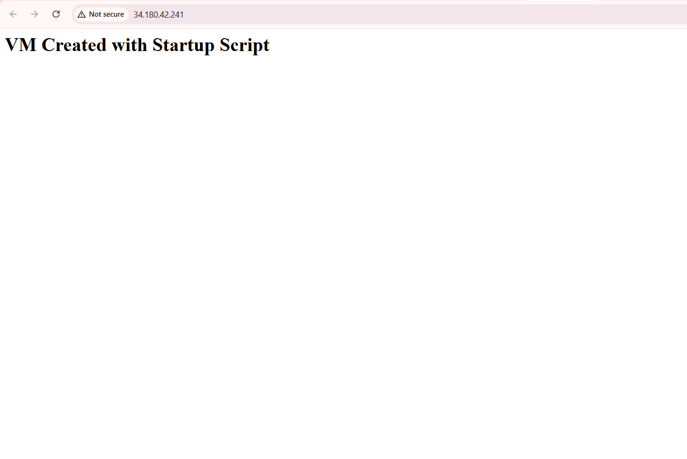

# LEVEL 3 — INTERMEDIATE (Template + MIG + Load Balancing)

## Scenario

Imagine you run a website. During normal traffic, a few servers are enough. But during festivals or sales events, traffic increases dramatically.

You need:
- A solution that automatically adds more servers when traffic spikes and removes them when traffic goes back to normal (Managed Instance Groups - MIGs).
- A solution that distributes incoming traffic across multiple servers so that no single server is overwhelmed (Load Balancing).
- Health checks to ensure traffic is only sent to healthy servers. If a server becomes unhealthy, the load balancer stops sending traffic to it and redirects requests to healthy instances.

### How They Work Together
- **Managed Instance Groups (MIGs):** Automatically scale the number of VM instances based on traffic.
- **Load Balancer:** Distributes user requests across those instances.
- **Health Checks:** Ensure traffic goes only to healthy servers.

---

## Steps

### 1. Create Instance Template
1. Go to **Compute Engine → Instance Templates**
2. Click **Create Instance Template**
3. Configure:
   - Machine type: `e2-micro` (for testing)
   - Boot disk: Ubuntu / Debian
   - Firewall: Allow HTTP traffic
   - Startup script example: (This will show which VM handled the request)
4. Click **Create**
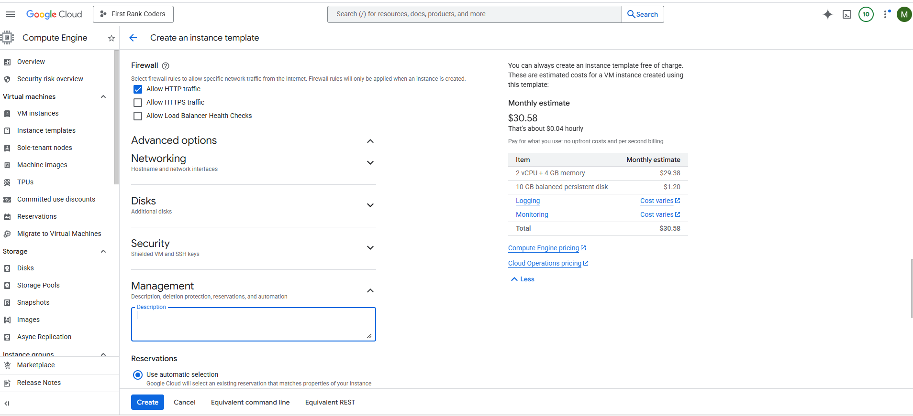

### 2. Create a Managed Instance Group (MIG)
1. Go to **Compute Engine → Instance Groups**
2. Click **Create Instance Group**
3. Select **New Managed Instance Group**
4. Configure:
   - Instance Template: Select the template created earlier
   - Location: Single zone or multi-zone
   - Autoscaling: Enable
   - Minimum instances: 2
   - Maximum instances: 4
   - Target CPU utilization: 60%
5. Click **Create**
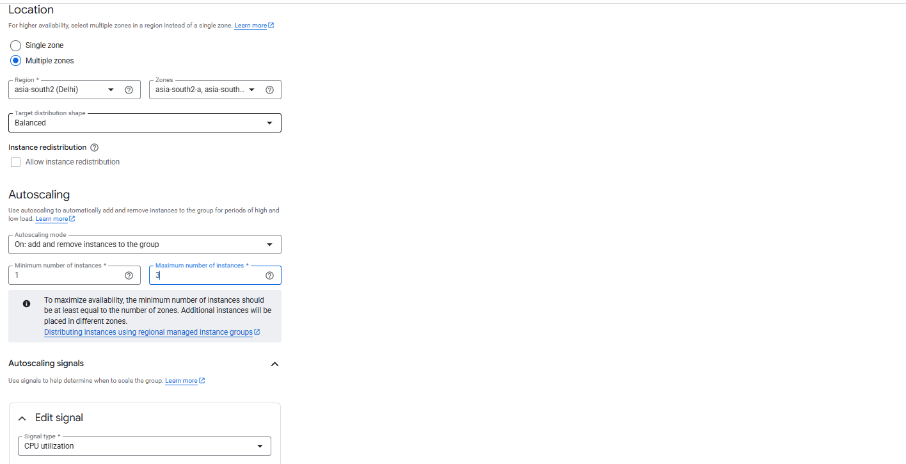

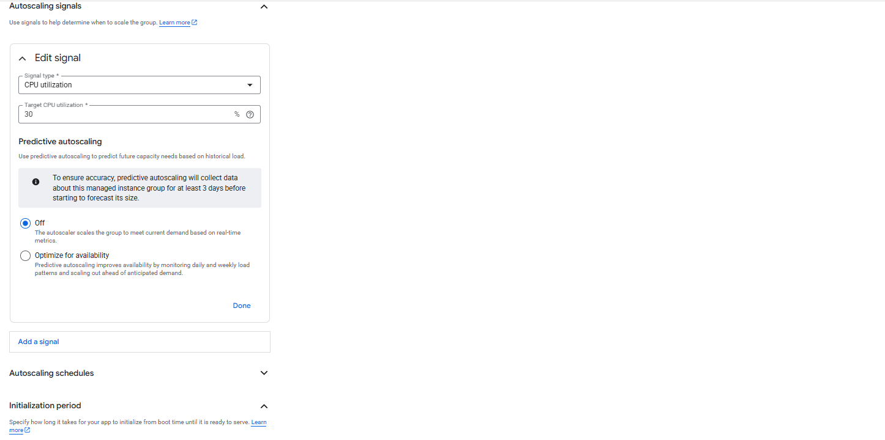
Now GCP automatically manages multiple VMs.

### 3. Create a Health Check
1. Go to **Network Services → Health Checks**
2. Click **Create Health Check**
3. Configuration:
   - Name: `web-health-check`
   - Protocol: HTTP
   - Port: 80
   - Check interval: 5 seconds
   - Timeout: 5 seconds
4. Click **Create**

### 4. Create a Backend Service
1. Go to **Network Services → Load Balancing**
2. Click **Create Load Balancer**
3. Select **HTTP Load Balancer**
4. Configure backend:
   - Click **Create Backend Service**
   - Add Managed Instance Group
   - Select the health check created earlier
5. Click **Create**
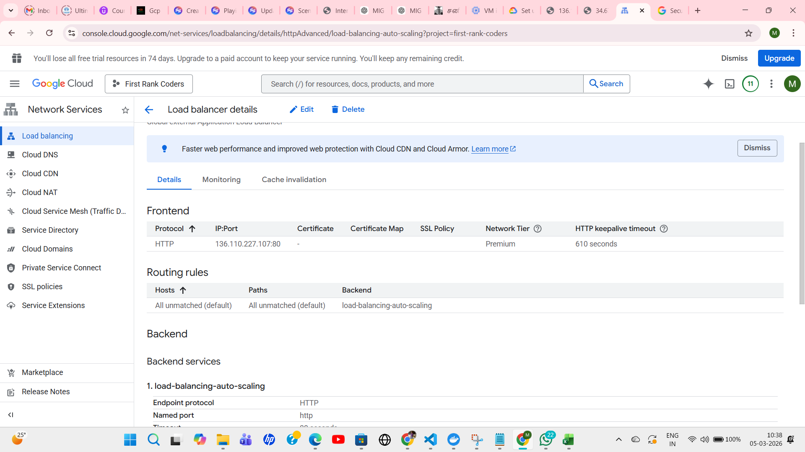 
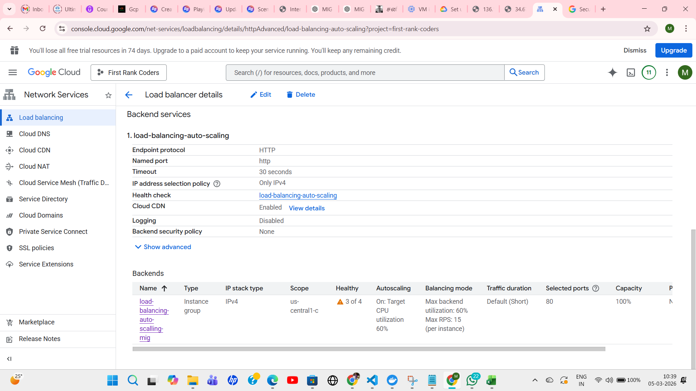
### 5. Configure URL Map
- The URL Map decides how traffic is routed.
- Example: `/` → Backend service
- Usually default settings are enough.

### 6. Configure Frontend
- The Frontend is the public entry point for users.
- Settings:
   - Protocol: HTTP
   - Port: 80
   - IP: Create new external IP
- Click **Create**

### 7. Test the Load Balancer
After deployment:
1. Copy the external IP
2. Open in browser (e.g., `http://34.xxx.xxx.xxx`)
3. Refresh multiple times
4. You will see different responses like:
   - Server: instance-abc
   - Server: instance-def
   - Server: instance-xyz
5. This confirms traffic is distributed across instances.

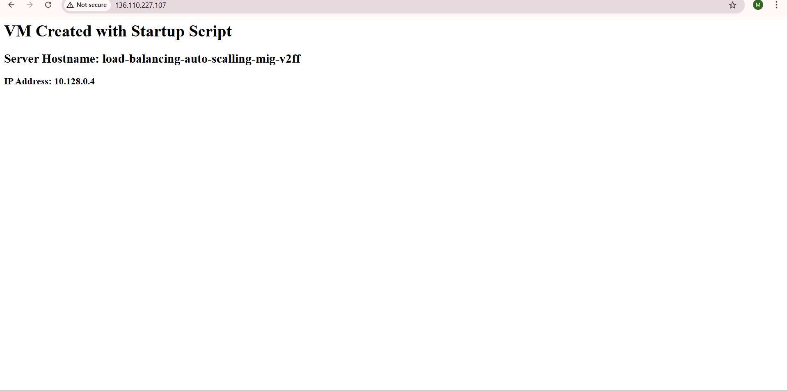 
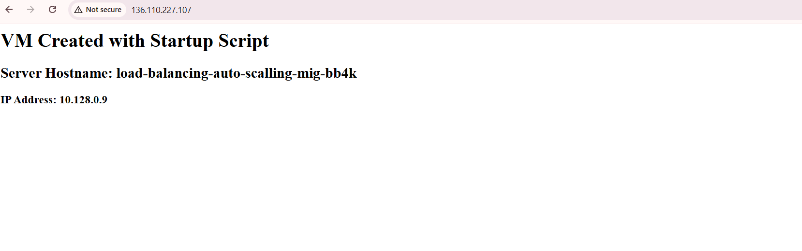 
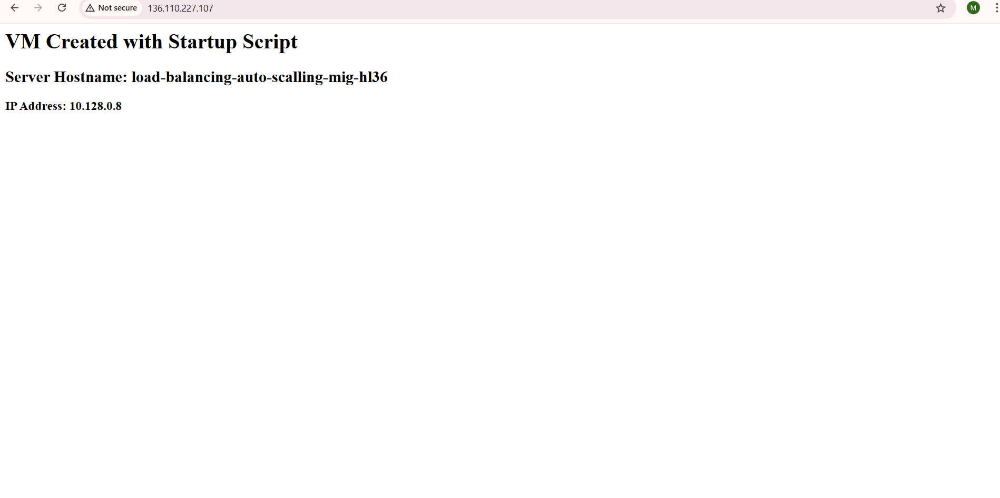

## Final Architecture

### What Happens During Traffic Spike
- More users access the website
- CPU usage increases
- Autoscaler adds more VM instances
- Load balancer distributes traffic
- Health checks ensure failed instances are removed

**Result:**
- High availability
- Automatic scaling
- Fault tolerance

## Why Load Balancer Matters

**Architect rule:**
> Never expose VM instances directly to users. Always use a load balancer.

### Problems without Load Balancer
- If one VM crashes → users can't access the app
- Traffic not distributed evenly
- No automatic failover
- Scaling doesn't help without distribution

### With Load Balancer
✔ Single entry point for all traffic
✔ Automatic distribution across VMs
✔ Health checks ensure only healthy VMs receive traffic
✔ Seamless scaling up/down

### Real-world Impact
During a traffic spike:
- MIG adds 10 new VMs automatically
- Load Balancer instantly routes traffic to all 10
- Users experience no slowdown
- When traffic normalizes, extra VMs are removed

# 🟡 LEVEL 4 — INTERMEDIATE (Tempalte + MIG + Load Balancing + Github Action)
# 🟡 LEVEL 5 — INTERMEDIATE (Tempalte + MIG + Load Balancing + Github Action + Docker)


