# Google Compute Engine (GCE)

## 📌 What is Compute Engine?

**Google Compute Engine (GCE)** is an Infrastructure-as-a-Service (IaaS) offering from
Google Cloud Platform.

It allows you to create and manage **Virtual Machines (VMs)** on Google’s global infrastructure.

With
Google Compute Engine,
you get full control over:

* Operating system
* CPU & Memory configuration
* Storage
* Networking
* Security policies
* Scaling behavior

It is similar to AWS EC2 in concept.

---

# 🚀 Key Features of Compute Engine


## 1️⃣ Virtual Machines (VMs)

* Linux and Windows support
* Predefined and custom machine types
* GPU & high-memory instances

**Why Virtual Machines?**

VMs provide the foundation for running any workload in the cloud, offering flexibility to choose OS, hardware specs, and software stack. You can migrate legacy apps, run custom code, and control every aspect of your environment, making VMs ideal for diverse use cases from development to production.


## 2️⃣ Custom Machine Types

* Choose exact vCPU and RAM
* Optimize cost
* Avoid overprovisioning

**Why Custom Machine Types?**

Custom machine types let you tailor resources to your workload, avoiding unnecessary costs and maximizing performance. You can fine-tune CPU and memory for each VM, ensuring efficient use of cloud resources and better cost control.

| Machine | Best For        | Cost   | Performance |
| ------- | --------------- | ------ | ----------- |
| E2      | Dev, small apps | Low    | Moderate    |
| N2      | Production APIs | Medium | High        |
| C2      | CPU heavy apps  | High   | Very High   |

---


## 3️⃣ Persistent Storage

* Standard persistent disk
* SSD persistent disk
* Local SSD (high performance)
* Snapshots & backups

**Why Persistent Storage?**

Persistent Storage ensures your data survives VM restarts, failures, and scaling events. Unlike ephemeral disks, persistent disks are independent of VM lifecycle, making them ideal for databases, application state, and backups. You can easily resize, snapshot, and attach/detach persistent disks to different VMs, supporting high availability and disaster recovery.

---


## 4️⃣ Managed Instance Groups (MIG)

* Auto scaling
* Auto healing
* Rolling updates
* Multi-zone deployment

**Why Managed Instance Groups?**

MIGs automate the deployment, scaling, and management of identical VM instances. They ensure your application is always available by automatically replacing unhealthy VMs and scaling up/down based on demand. When combined with Load Balancing, MIGs allow seamless distribution of traffic across healthy instances, enabling high availability, fault tolerance, and zero-downtime updates.

**Relationship to Load Balancing:**

Load Balancing works best with MIGs, as it can dynamically route traffic to VMs managed by the group. MIGs provide the pool of instances, while Load Balancing ensures users are always directed to healthy, responsive servers. This combination is essential for scalable, resilient cloud architectures.

---


## 5️⃣ Load Balancing

Using Cloud Load Balancing

* Distributes traffic across instances
* Global Anycast IP
* SSL termination
* Health checks

**Why Load Balancing?**

Load Balancing ensures high availability and scalability by distributing incoming traffic across multiple VM instances. It prevents any single server from being overwhelmed, provides automatic failover, and enables seamless scaling during traffic spikes. Health checks guarantee only healthy instances receive traffic, improving reliability.

---


## 6️⃣ Startup Scripts & Automation

* Automatically install software during VM boot
* Infrastructure automation
* Reproducible environments

**Why Startup Scripts & Automation?**

Startup scripts automate VM configuration, software installation, and environment setup during boot. This enables consistent, repeatable deployments, reduces manual errors, and supports infrastructure-as-code practices for scalable operations.

---


## 7️⃣ Custom Images

* Faster VM startup
* Preconfigured application environments
* Production-grade scaling

**Why Custom Images?**

Custom images allow you to pre-build VM environments with required software and configurations. This speeds up VM launches, ensures consistency across deployments, and simplifies scaling production workloads.

---


## 8️⃣ Security Features

* IAM roles & service accounts
* Shielded VMs
* VPC firewall rules
* Integration with Cloud Armor for DDoS protection

**Why Security Features?**

Security features protect your infrastructure from threats and unauthorized access. IAM roles and service accounts enforce least-privilege access, Shielded VMs defend against rootkits and boot-level attacks, VPC firewalls control network traffic, and Cloud Armor provides DDoS protection for mission-critical workloads.

---


## 9️⃣ Cost Optimization

* Sustained use discounts
* Committed use discounts
* Spot VMs (low-cost compute)
* Custom machine types

**Why Cost Optimization?**

Cost optimization features help you reduce cloud expenses without sacrificing performance. Sustained and committed use discounts reward long-term usage, Spot VMs offer low-cost compute for flexible workloads, and custom machine types prevent overprovisioning. Together, these tools maximize value for your cloud investment.

---

# 🛠 How to Use Compute Engine

## Step 1: Create a VM

1. Go to GCP Console
2. Navigate to Compute Engine → VM Instances
3. Click “Create Instance”
4. Select:

   * Machine type
   * Region & Zone
   * OS image
   * Firewall rules

---

## Step 2: Install Application (Example – NGINX)

```bash
sudo apt update
sudo apt install nginx -y
sudo systemctl start nginx
```

Access:

```
http://EXTERNAL_IP
```

---

## Step 3: Production Setup

For production-grade systems:

* Use Instance Templates
* Create Managed Instance Group
* Configure Autoscaling
* Attach Load Balancer
* Enable Health Checks
* Use HTTPS

---

# 📊 When to Use Compute Engine

Use Compute Engine when:

✅ You need full OS-level control
✅ Running legacy applications
✅ Migrating on-prem workloads
✅ Custom networking is required
✅ High-performance computing is needed
✅ Stateful applications require fine tuning

---

# ❌ When NOT to Use Compute Engine

Avoid Compute Engine if:

❌ You want fully managed serverless apps → Use Cloud Run
❌ You want container orchestration → Use GKE
❌ You want simple PaaS → Use App Engine

---

# 🏗 Real-World Use Cases

* Hosting FastAPI / Django backend
* Running enterprise ERP systems
* ML workloads with GPU
* Batch processing jobs
* Hybrid cloud migrations
* Multi-tier web applications

---

# 🧠 Architecture Example

```
Users
   ↓
Global Load Balancer
   ↓
Managed Instance Group (Multi-Zone)
   ↓
Compute Engine VMs
   ↓
Database (Cloud SQL)
```

---

# 🔥 Advantages

* Full flexibility
* High scalability
* Enterprise-grade infrastructure
* Global availability
* Strong integration with other GCP services

---

# ⚠ Considerations

* Requires infrastructure management
* Needs monitoring & scaling configuration
* Security must be properly configured
* Not fully serverless

---

# 📌 Summary

Google Compute Engine provides powerful, flexible, and scalable virtual machines on Google Cloud infrastructure.

It is best suited for:

* Custom applications
* Migration workloads
* Production systems needing full control

When designed with:

* Managed Instance Groups
* Load Balancing
* Autoscaling
* Security best practices

It becomes a highly available and enterprise-ready solution.


Perfect 👍
Now we move into **hands-on Architect-style task scenarios**.

We’ll continue one evolving system:

> 🛒 **CloudCart API (FastAPI/Django)**
> App VM(s) + Nginx + Separate DB VM
> Then evolve into Template → MIG → Load Balancer → HA → Production-ready

Each level:

* Clear objective
* Real-world scenario
* What to build
* Why architecturally
* Expected outcome

---

# LEVEL 1 — BASIC (Single VM Architecture)

## 🔹 Task 1: Create a VM and Setup Nginx (Manual Setup)

🔹 Step 1: Create a Virtual Machine (VM) in GCP


Navigate to:
☰ Menu → Compute Engine → VM instances

Click Create Instance

Configure the VM:

Name: fual-finder


Region/Zone: Choose your preferred location (asia-south1-a (Mumbai))


Machine Type: e2-micro (Free tier eligible)

Boot Disk:
Click Change
Select Ubuntu 22.04 LTS
Size: 10 GB (default is fine)


Under Firewall, check:
✅ Allow HTTP traffic
(Optional) ✅ Allow HTTPS traffic
Click Create

⏳ Wait for the VM to start.

🔹 Step 2: Connect to the VM


Once the VM status shows **Running**:


Click **SSH** next to your VM instance to connect.


🔹 Step 3: Update the System

Run:
```base
      sudo apt update
      sudo apt upgrade -y
```
🔹 Step 4: Install Nginx

Run:
```base
   sudo apt install nginx -y
```
🔹 Step 5: Start and Enable Nginx
```base
   sudo systemctl start nginx
   sudo systemctl enable nginx
```

Check status:
```base
   sudo systemctl status nginx
```

You should see:

Active: active (running)

Open browser and visit:

http://YOUR_EXTERNAL_IP

You should see:

🎉 Welcome to nginx! page

open /var/www/html

Create index.html
```base
   sudo nano index.html
```

Add Below content and Save


Open http://YOUR_EXTERNAL_IP
You can see like below


---
# LEVEL 2 — Intermidate (Create VM with Self Script)

Follow the Same like Basic setup upto Firewall setup then 


Click Advance Add Automation Script like below 
```
apt update -y
apt upgrade -y
apt install -y nginx
systemctl start nginx
systemctl enable nginx
echo "<h1>VM Created with Startup Script</h1>" > /var/www/html/index.html
```


Click Create

Verify 
Open http://YOUR_EXTERNAL_IP
You should see:


# LEVEL 3 — INTERMEDIATE (Template + MIG + Load Balancing)

## Scenario

Imagine you run a website. During normal traffic, a few servers are enough. But during festivals or sales events, traffic increases dramatically.

You need:
- A solution that automatically adds more servers when traffic spikes and removes them when traffic goes back to normal (Managed Instance Groups - MIGs).
- A solution that distributes incoming traffic across multiple servers so that no single server is overwhelmed (Load Balancing).
- Health checks to ensure traffic is only sent to healthy servers. If a server becomes unhealthy, the load balancer stops sending traffic to it and redirects requests to healthy instances.

### How They Work Together
- **Managed Instance Groups (MIGs):** Automatically scale the number of VM instances based on traffic.
- **Load Balancer:** Distributes user requests across those instances.
- **Health Checks:** Ensure traffic goes only to healthy servers.
- **GitHub Actions (CI/CD):** Automatically deploy application updates when developers push new code.
- **Workload Identity Federation:**  Securely authenticates GitHub Actions with Google Cloud without storing service account keys.
- **Rolling Updates:** Deploy new application versions gradually across instances without downtime.

## Steps

### 1. Create Instance Template
1. Go to **Compute Engine → Instance Templates**
2. Click **Create Instance Template**
3. Configure:
   - Machine type: `e2-micro` (for testing)
   - Boot disk: Ubuntu / Debian
   - Firewall: Allow HTTP traffic
   - Startup script example: (This will show which VM handled the request)
4. Click **Create**


### 2. Create a Managed Instance Group (MIG)
1. Go to **Compute Engine → Instance Groups**
2. Click **Create Instance Group**
3. Select **New Managed Instance Group**
4. Configure:
   - Instance Template: Select the template created earlier
   - Location: Single zone or multi-zone
   - Autoscaling: Enable
   - Minimum instances: 2
   - Maximum instances: 4
   - Target CPU utilization: 60%
5. Click **Create**


Now GCP automatically manages multiple VMs.

### 3. Create a Health Check
1. Go to **Network Services → Health Checks**
2. Click **Create Health Check**
3. Configuration:
   - Name: `web-health-check`
   - Protocol: HTTP
   - Port: 80
   - Check interval: 5 seconds
   - Timeout: 5 seconds
4. Click **Create**

### 4. Create a Backend Service
1. Go to **Network Services → Load Balancing**
2. Click **Create Load Balancer**
3. Select **HTTP Load Balancer**
4. Configure backend:
   - Click **Create Backend Service**
   - Add Managed Instance Group
   - Select the health check created earlier
5. Click **Create**


### 5. Configure URL Map
- The URL Map decides how traffic is routed.
- Example: `/` → Backend service
- Usually default settings are enough.

### 6. Configure Frontend
- The Frontend is the public entry point for users.
- Settings:
   - Protocol: HTTP
   - Port: 80
   - IP: Create new external IP
- Click **Create**

### 7. Test the Load Balancer
After deployment:
1. Copy the external IP
2. Open in browser (e.g., `http://34.xxx.xxx.xxx`)
3. Refresh multiple times
4. You will see different responses like:
   - Server: instance-abc
   - Server: instance-def
   - Server: instance-xyz
5. This confirms traffic is distributed across instances.


## Final Architecture

### What Happens During Traffic Spike
- More users access the website
- CPU usage increases
- Autoscaler adds more VM instances
- Load balancer distributes traffic
- Health checks ensure failed instances are removed

**Result:**
- High availability
- Automatic scaling
- Fault tolerance

## Why Load Balancer Matters

**Architect rule:**
> Never expose VM instances directly to users. Always use a load balancer.

### Problems without Load Balancer
- If one VM crashes → users can't access the app
- Traffic not distributed evenly
- No automatic failover
- Scaling doesn't help without distribution

### With Load Balancer
✔ Single entry point for all traffic
✔ Automatic distribution across VMs
✔ Health checks ensure only healthy VMs receive traffic
✔ Seamless scaling up/down

### Real-world Impact
During a traffic spike:
- MIG adds 10 new VMs automatically
- Load Balancer instantly routes traffic to all 10
- Users experience no slowdown
- When traffic normalizes, extra VMs are removed

# LEVEL 4 — Advance (Template + MIG + Github Action)
## Scenario

Imagine you run a website. During normal traffic, a few servers are enough. But during festivals or sales events, traffic increases dramatically. At the same time, your development team frequently releases new features, bug fixes, and improvements to the FastAPI application.

You need:
- A solution that automatically adds more servers when traffic spikes and removes them when traffic goes back to normal (Managed Instance Groups - MIGs).
- A solution that distributes incoming traffic across multiple servers so that no single server is overwhelmed (Load Balancing).
- Health checks to ensure traffic is only sent to healthy servers. If a server becomes unhealthy, the load balancer stops sending traffic to it and redirects requests to healthy instances.  
- A secure CI/CD pipeline that automatically deploys new FastAPI updates whenever developers push code (GitHub Actions).

- A secure authentication mechanism between GitHub and Google Cloud without storing service account keys (Workload Identity Federation).

- A rolling deployment strategy so application updates happen without downtime, ensuring users can continue using the website even during deployments.

## Steps
The infrastructure setup for Instance Template, Managed Instance Groups, Load Balancer, and Health Checks is the same as described in LEVEL 3.

Refer to LEVEL 3 — Template + MIG + Load Balancing for the infrastructure configuration.

> Note: Since this setup uses a FastAPI application, make sure to update or replace the startup script in the Instance Template

Create A Fast API Application and push Github & use for startup script setpu


```
#!/bin/bash

set -e

apt-get update
apt-get install -y git python3-pip python3-venv

cd /opt

git clone https://github.com/vktrenga/gcp-learning-projects.git

cd gcp-learning-projects/fastapi-mig-ci-cd

python3 -m venv venv

venv/bin/pip install -r requirements.txt

nohup venv/bin/python -m uvicorn app.main:app --host 0.0.0.0 --port 8000 &

```

### 1. Create Service Account and Bind Role
1. Go to:
2. Open Google Cloud Console
```
IAM & Admin → Service Accounts
```
3. Click
```
CREATE SERVICE ACCOUNT
```

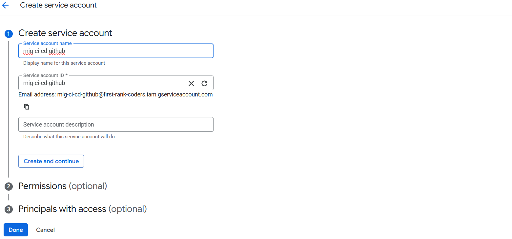

4. Bind Role to Service Account
```
Compute Admin
Storage Admin
Service Account User
```

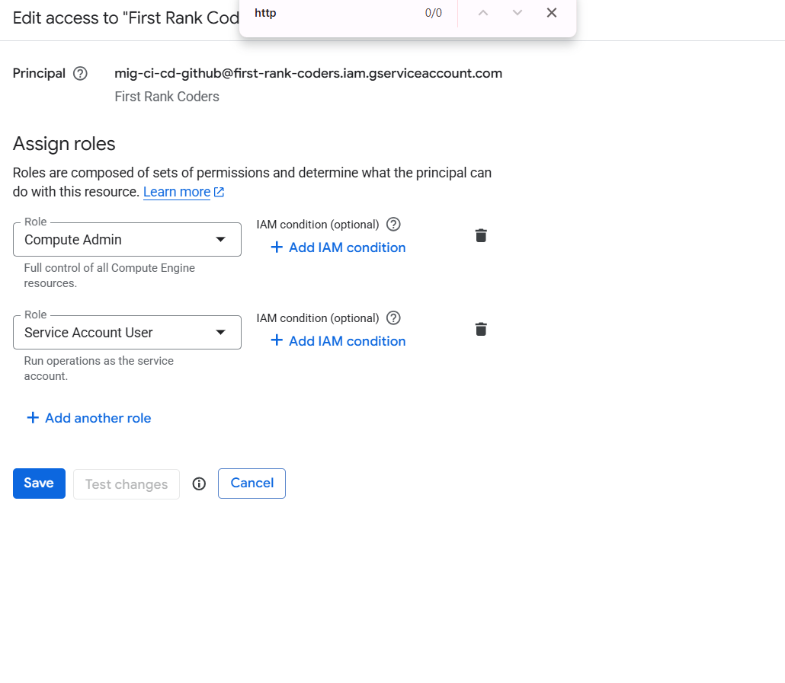

Now your service account exists:


### 2. Setup Workload Identity Federation
Go to: 
```
IAM → Workload Identity Federation

Click Create Pool
Pool Name: {{Pool Name}}
```

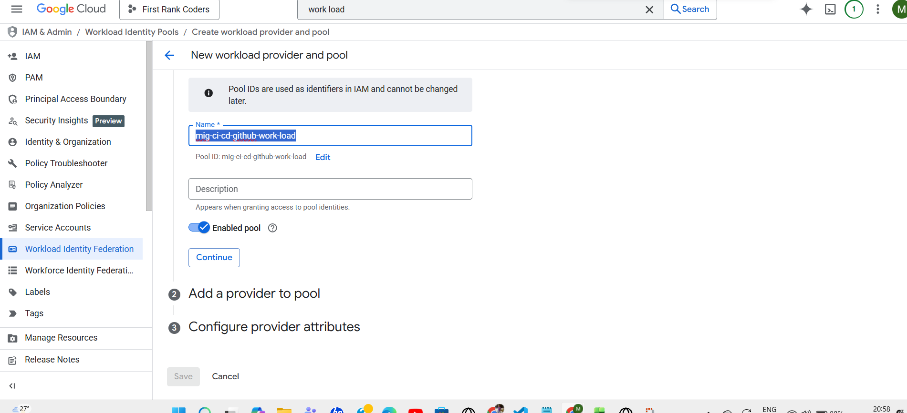


Add Provider:
```
Provider: {{provider Name}}
Issuer URL:
https://token.actions.githubusercontent.com

```


Attribute mapping:
```
google.subject=assertion.sub
attribute.actor=assertion.actor
attribute.repository=assertion.repository
```

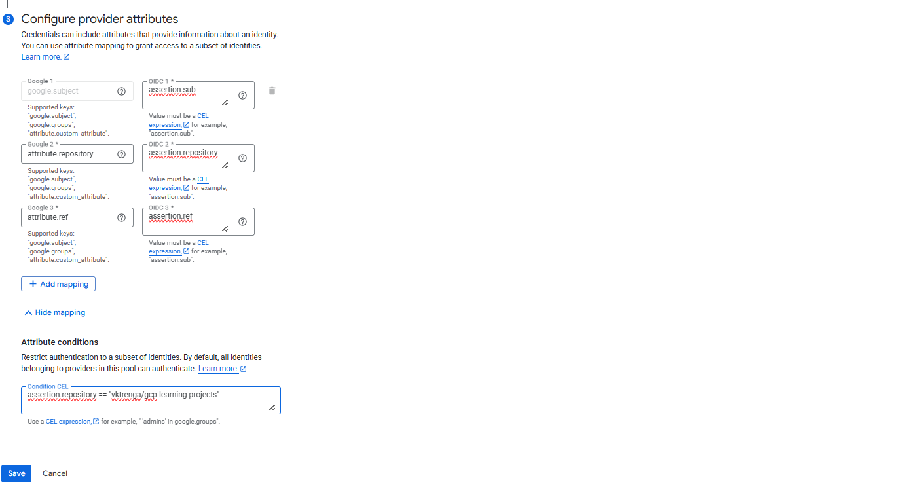

### 3. Allow Identity to Use Service Account
Go to:
```
IAM & Admin → Service Accounts
```
Select your service account.

Click:
```
PERMISSIONS → GRANT ACCESS
```
Add Your principal:
Example:
```
principalSet://iam.googleapis.com/projects/PROJECT_NUMBER/locations/global/workloadIdentityPools/github-pool/attribute.repository/USERNAME/REPO
```


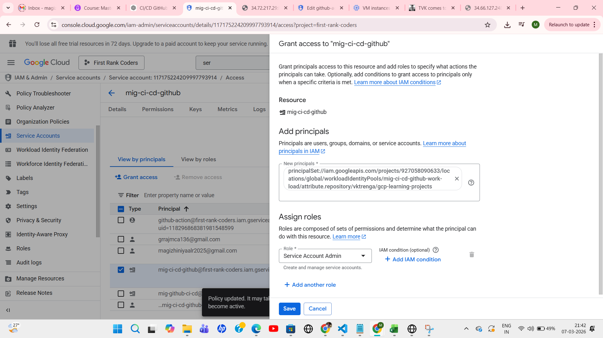

### 4. Create GitHub Action Workflow

Create file at your code base
```
.github/workflows/deploy.yml
```
Add workload_identity_provider
Add service_account

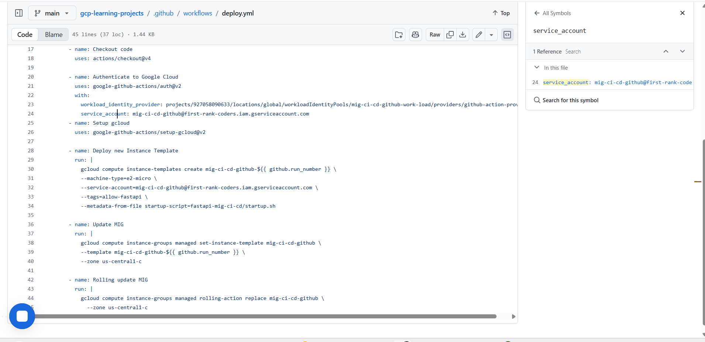


CI & CD Pipe Line Setup
-> Deploy new Instance Template
-> Update Managed Instacne Group by New Instance Template
-> Rolling update MIG 
-> Push the code & Check Deployment


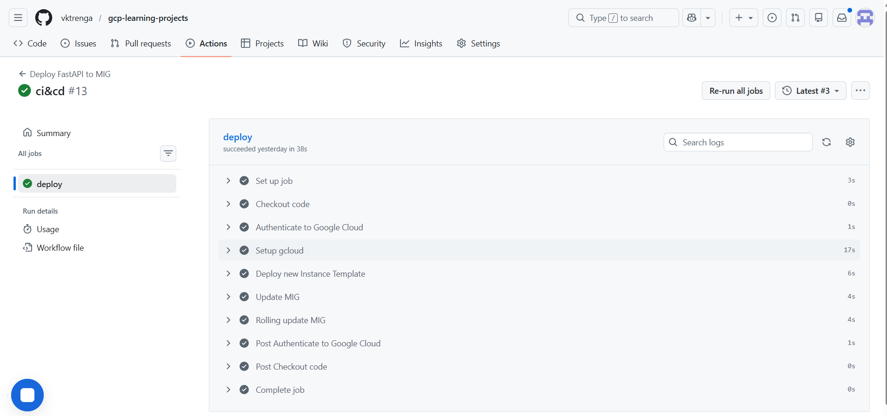

> Note: Instead of defining workload_identity_provider and service_account directly in the workflow file, store them securely in GitHub Secrets Manager and reference them from there.

# LEVEL 5 — Advance (Template + MIG + Load Balancing + Github Action + Docker)
Imagine you run a website. During normal traffic, a few servers are enough. However, during festivals or sales events, traffic increases dramatically. At the same time, your development team frequently releases new features, bug fixes, and improvements to the FastAPI application across different environments such as Development (Dev), Staging, and Production.

You need:
   > We should follow same like above other services except docker
   > The application is packaged using Docker, ensuring that the same environment runs across development, staging, and production servers.

### How They Work Together

   **Managed Instance Group (MIGs)**: Automatically scale the number of VM instances based on incoming traffic.

   **Cloud Load Balancing:** Distributes user requests evenly across the available instances.

   **Health Checks:** Continuously monitor VM instances and ensure traffic is sent only to healthy servers.

   **GitHub Actions (CI/CD):** Automatically builds and deploys application updates when developers push new code.

   **Workload Identity Federation:** Securely authenticates GitHub Actions with Google Cloud without storing service account keys.

   **Rolling Updates:** Gradually deploy new application versions across instances to avoid downtime.

   **Artifact Registry:** Stores the Docker images built during the CI/CD pipeline.

   **Docker:** Packages the FastAPI application into containers for consistent deployment across environments.

## Steps
### Enable Required APIs
1. Go to **APIs & Services → Library**
2. Search & Open **Artifact Registry API** 
3. Click Enable Button

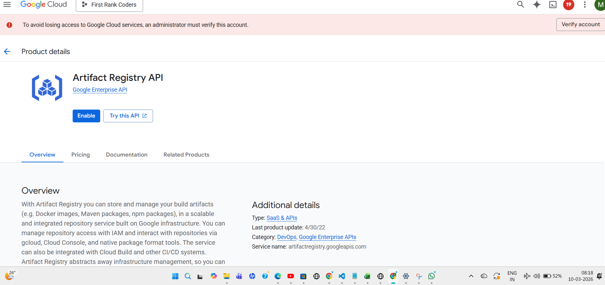
Do the same approch other services whic h are needs

### Create Artifact Registry
1. Go to **Artifact Registry→ Repositories**
2. Click **Create Repository** 
3. Configure:
   - Name: `mig-docker-github-fastapi`
   - Format: Docker
   - Location: Same as your Compute Engine instances
   - Mode : Standard
   - Keep other options as default (Immutable image tags, Cleanup policies,Vulnerability scanning) If you need changes do as per your requirement 
4. Click Create Button

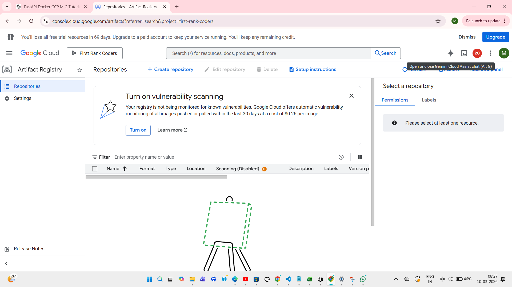
5. Copy the URL 

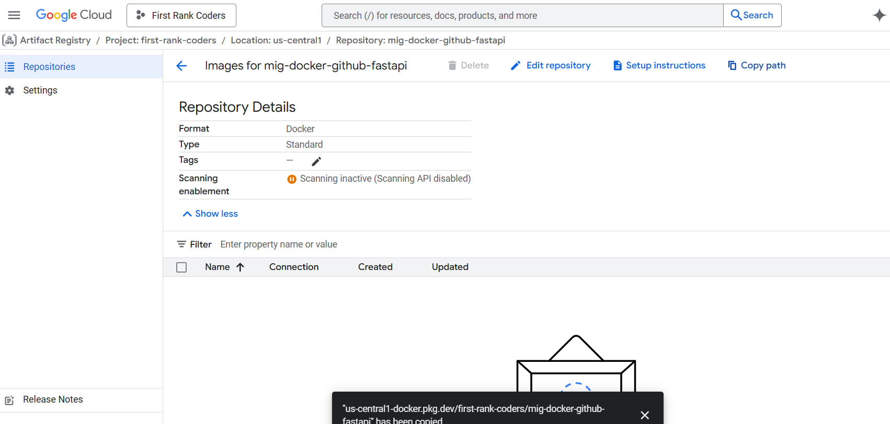
Example : us-central1-docker.pkg.dev/first-rank-coders/mig-docker-github-fastapi

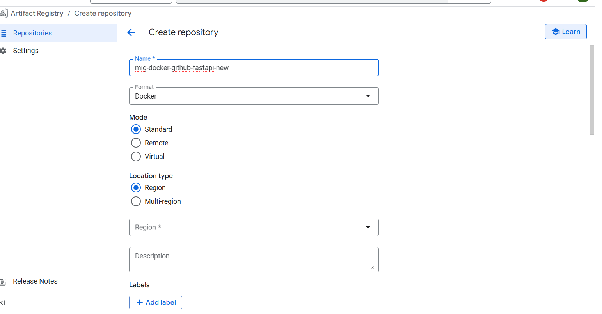
### Create Service Account and Bind Role
  > Follow the same approch of previous scenaria's Step 1
  Roles:
   ```
      Artifact Registry Writer
      Compute Admin
      Service Account User
   ```

### Setup Workload Identity Federation (GitHub → GCP)
  > Follow the same approch of previous scenaria's Step 2

### Allow Identity to Use Service Account 
   > Follow the same approch of previous scenaria's Step 2


### Create Instance Template  
   > Follow the same approch of previous scenaria's Step 1 but remove the startup script because we will use docker to run our application use Start Up like bellow 

   ```
   #!/bin/bash

# Wait for system to finish booting for booting
sleep 30

# Update packages
apt-get update -y

# Install Docker
apt-get install -y docker.io

# Start Docker
systemctl daemon-reexec
systemctl start docker
systemctl enable docker

# Wait until Docker is ready
until docker info >/dev/null 2>&1; do
  sleep 5
done

# Authenticate Docker to Artifact Registry
gcloud auth configure-docker us-central1-docker.pkg.dev -q

# Pull Docker image
docker pull us-central1-docker.pkg.dev/first-rank-coders/mig-docker-github-fastapi/fastapi:latest

# Run FastAPI container
docker run -d -p 80:8000 \
--name fastapi-container \
--restart always \
us-central1-docker.pkg.dev/first-rank-coders/mig-docker-github-fastapi/fastapi:latest

   ```
### Create Manage Instance Group & Health Check 
   > Follow the same approch of previous scenaria's Step 2

Notes : Before Create a Fast API application and push it in Github with workflow 
   https://github.com/vktrenga/gcp-learning-projects/tree/main/fastapi-mig-ci-cd-docker

You can see the docker images on Artifact Registory


You can check your application both Brower and curl


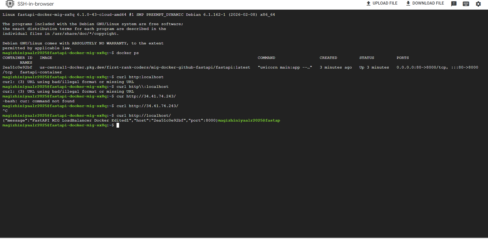
