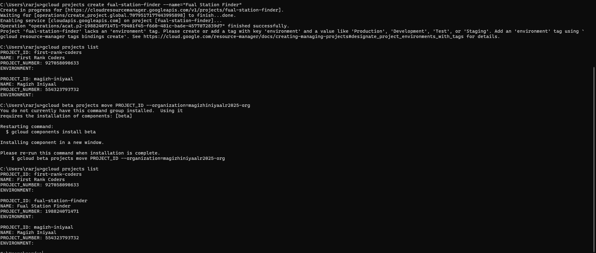
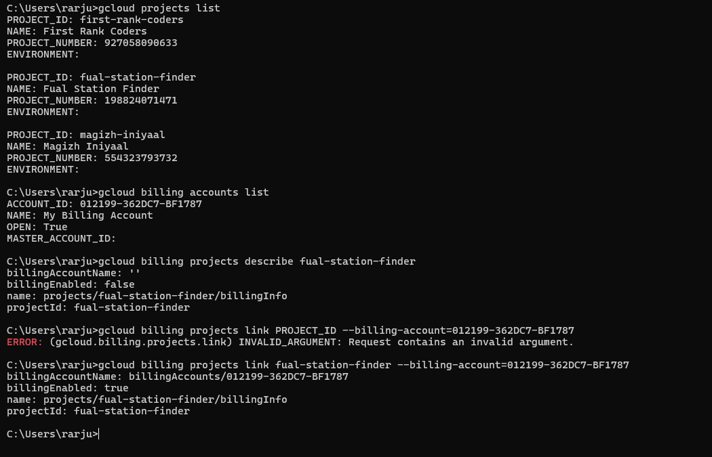

Here is your complete **README-ready** section. You can copy and paste directly into your `README.md`.

---

# Foundation Setup – Project & Billing

## Organization

* Top-level node representing your company (requires Cloud Identity / Workspace).
* Single Organization per domain.
* Owns Folders and Projects.
* IAM and Organization Policies set here inherit down the tree.
* Typical uses: corporate-wide constraints, central audit and admin controls.

## Folders

* Optional, intermediate grouping between Organization and Projects.
* Can contain Projects and nested Folders.
* Useful for delegating administration and applying policies to logical groups (e.g., by team, environment, region).
* Policies and IAM bindings on a Folder apply to all descendant resources.

## Projects

* Fundamental deployable container for Google Cloud resources.
* Holds metadata: project ID, project number, billing account link, enabled APIs, quotas.
* Resources (VMs, buckets, datasets, etc.) are created inside a Project.
* Projects are portable within an Organization (subject to policy) and have a 30-day recovery window after deletion.
* Use projects to isolate lifecycle, billing, quota, and access for an application or team.

## Resources

* Concrete services and objects: Compute Engine instances, Cloud Storage buckets, BigQuery datasets, Pub/Sub topics, IAM bindings, etc.
* Inheritance: IAM and Org Policies set at Organization/Folder/Project levels affect resources.
* Some policies are resource-specific (e.g., bucket-level IAM), while others are project- or org-wide.

---

## Example Hierarchy

* Organization (example.com)

  * Folder: Finance

    * Project: billing-audit

      * Resource: BigQuery dataset (billing_reports)
  * Folder: Engineering

    * Folder: Platform

      * Project: infra-prod

        * Resource: Cloud Storage bucket (prod-assets)
      * Project: infra-staging

        * Resource: Cloud Storage bucket (staging-assets)
    * Project: app-service

      * Resource: GKE cluster / Compute VMs (app-service)
      * Resource: Pub/Sub topic (app-events)

---

## Notes

* Organization is the root and requires Cloud Identity / Workspace domain.
* Folders are optional grouping nodes that inherit policies to their descendants.
* Projects contain resources and are the billing/quota boundary.
* IAM and Organization Policies flow down the tree, but some resources (like buckets) can have resource-level IAM as well.

---

# Create a Project

## Using Google Cloud Console

1. Go to: [https://console.cloud.google.com/](https://console.cloud.google.com/)
2. Click the **Project selector** (top navigation bar).
3. Click **New Project**.
4. Enter:

   * Project Name
   * Organization (if applicable)
   * Location (Folder) (optional)
5. Click **Create**.
6. Wait ~30–60 seconds for provisioning.


---
## Using gcloud CLI

### Install & Setup Google Cloud CLI (Local Machine)

The gcloud CLI allows you to manage resources in Google Cloud directly from your terminal.

#### macOS (Homebrew)
brew install --cask google-cloud-sdk


If already installed:

brew upgrade google-cloud-sdk

#### Windows

Download installer from:
https://cloud.google.com/sdk/docs/install

Run the .exe file.

Follow the installation wizard.

Restart terminal after installation.

#### Linux (Debian / Ubuntu)
sudo apt update
sudo apt install google-cloud-cli


For other distributions:
https://cloud.google.com/sdk/docs/install


If installed correctly, it will display version details.

1️⃣Initialize gcloud

Run:
```bash 
gcloud init

```

This will:

Open browser for authentication

Allow you to log in


2️⃣ Verify Installation
```bash 
  gcloud version
```
3️⃣ Authenticate Manually (If Needed)
```bash 

gcloud auth login
```

4️⃣ Enable Application Default Credentials (For Development)
```bash 
gcloud auth application-default login
```

5️⃣ Test CLI Access

List projects:
```bash 
gcloud projects list
```

List enabled services:
```bash 
gcloud services list --enabled
```

## Project Setup
```bash
gcloud projects create PROJECT_ID \
  --name="PROJECT_NAME" \
  --organization=ORGANIZATION_ID
```

Verify:

```bash
gcloud projects list
```

Move Project to Specific organization If not set organization
```bash
gcloud beta projects move PROJECT_ID \
  --organization=ORGANIZATION_ID
```
---


# Enable Billing

> A project must be linked to a Billing Account before most resources can be used.

## Using Console

1. Navigate to **Billing** in the Console.
2. Select or create a Billing Account.
3. Click **Account Management**.
4. Click **Link a Project**.
5. Select your project.
6. Confirm.

---

## Using gcloud CLI

List billing accounts:

```bash
gcloud billing accounts list
```

Link billing account:

```bash
gcloud billing projects link PROJECT_ID \
  --billing-account=BILLING_ACCOUNT_ID
```

Verify billing status:

```bash
gcloud billing projects describe PROJECT_ID
```

---


## Using Console

1. Go to **APIs & Services → Library**
2. Search for a service (e.g., Compute Engine, Cloud Storage)
3. Click **Enable**

---

## Using gcloud CLI

```bash
gcloud services enable compute.googleapis.com
gcloud services enable storage.googleapis.com
```

List enabled services:

```bash
gcloud services list --enabled
```
---


# Day 1 Best Practices

* Use meaningful project naming (e.g., `team-app-prod`)
* Separate `prod`, `staging`, and `dev` projects
* Enable only required APIs
* Link billing immediately to avoid deployment failures
* Confirm quota limits early
* Keep environments isolated for security and cost control
