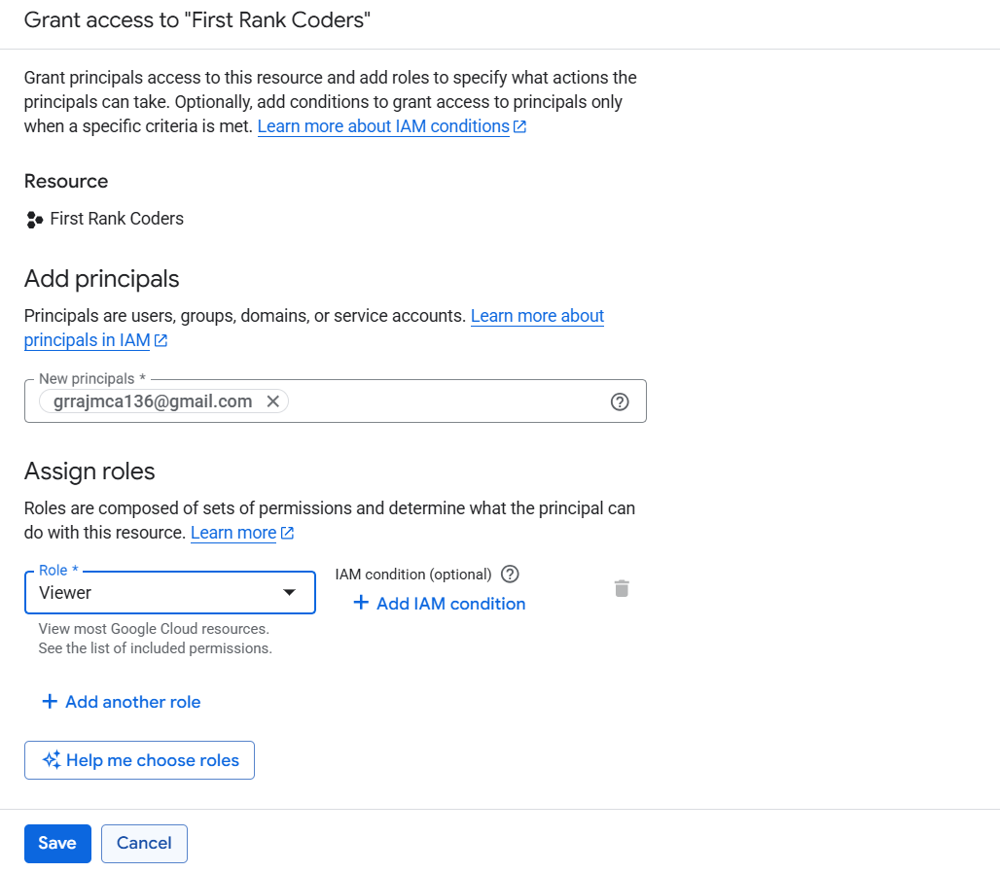
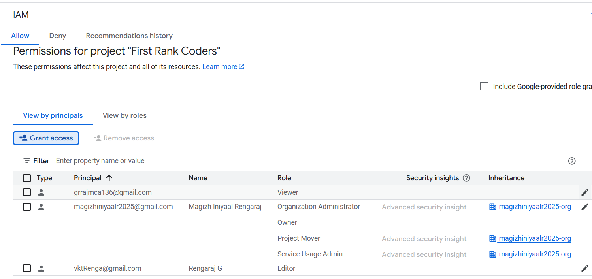
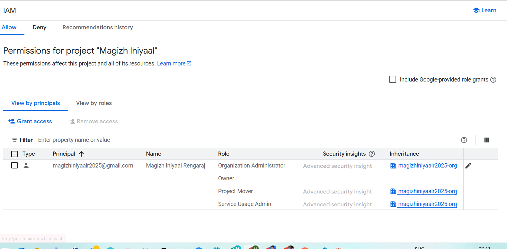
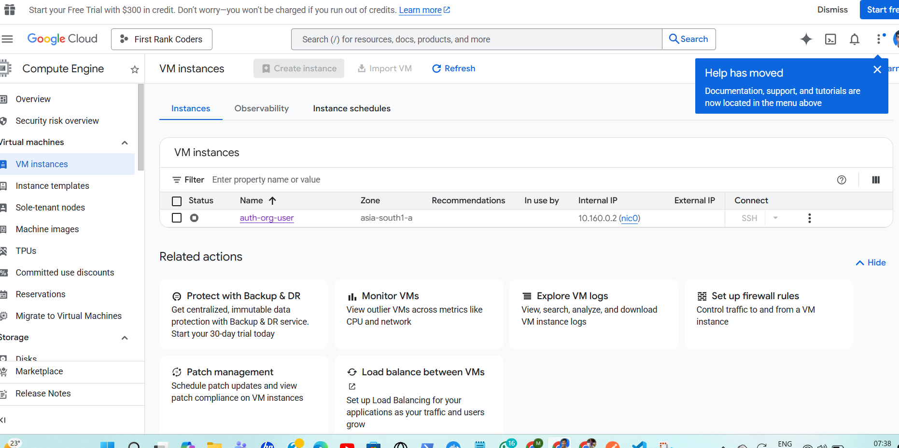
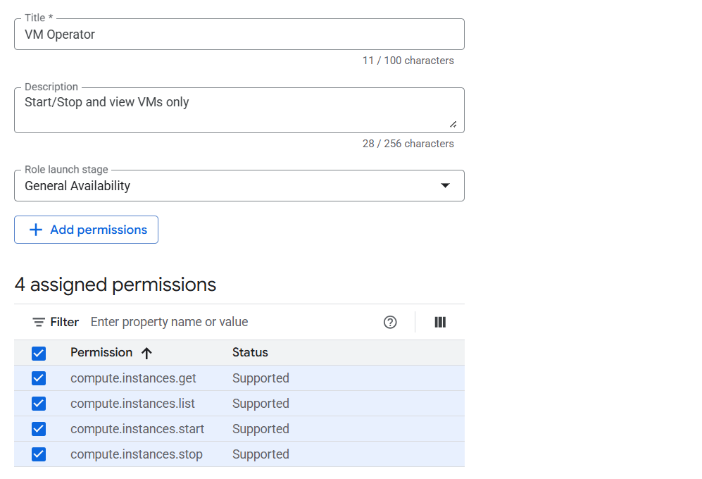
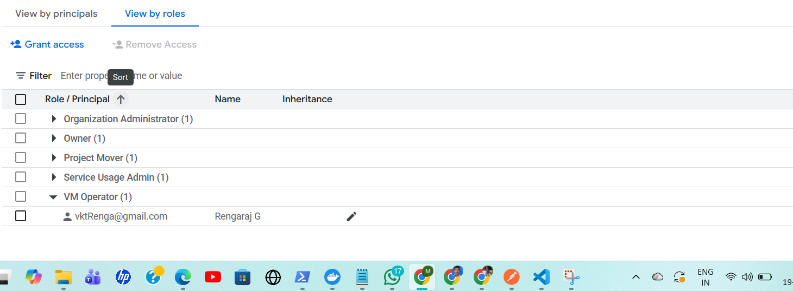
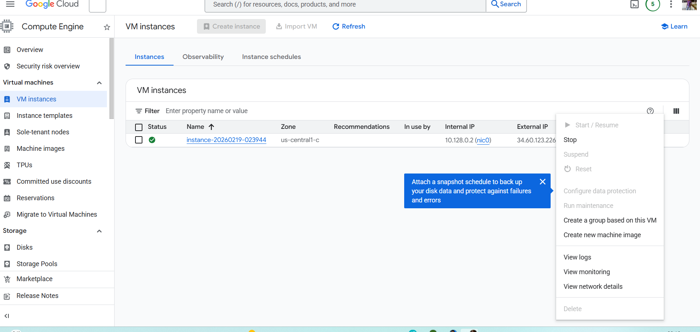
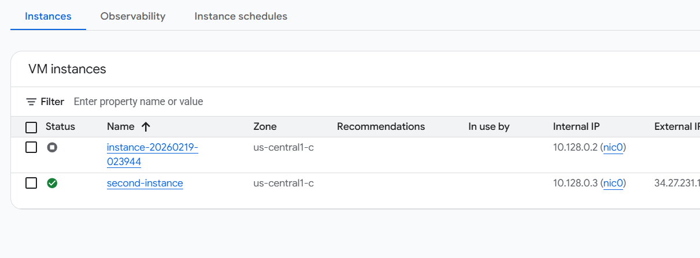
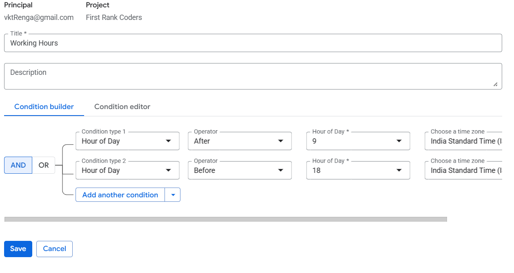
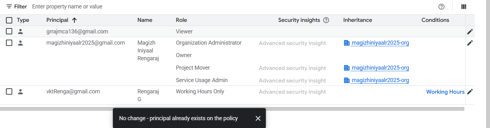

# Google Cloud IAM Overview

## 📌 Introduction

Identity and Access Management (IAM) controls access to Google Cloud resources.  
It defines who (identity) has what access (role) to which resource.

---

## 🏗 Resource Hierarchy

Google Cloud follows this structure:

Permissions are inherited downward:

Organization → Folder → Project → Resources

If access is granted at:
- **Organization level** → applies to all folders and projects  
- **Folder level** → applies to all projects inside that folder  
- **Project level** → applies only to that project and its resources  
Permissions are inherited downward.

---

## 👤 IAM Components

## 1️⃣ Principals
Identities that can be granted access:
- User
- Group
- Service Account
- Domain

---

### 2️⃣ Roles
A collection of permissions.

Types of roles:
- Basic Roles (Owner, Editor, Viewer)
- Predefined Roles
- Custom Roles

---

### 3️⃣ Resources
IAM can be applied at:
- Organization level
- Folder level
- Project level
- Individual resource level

---

## 🔐 Best Practices

- Follow Least Privilege Principle
- Avoid using Owner/Editor roles in production
- Use Groups instead of individual users
- Use Service Accounts for applications
- Enable Audit Logs
- Use IAM Conditions when necessary

---

## 🛠 Custom Roles

Custom roles allow granular permission control by selecting only required permissions instead of broad predefined roles.

Example:
- Start/Stop VM only
- Read-only storage access

---

## 🤖 Service Accounts

Service accounts are identities used by:
- Applications
- VMs
- Automation scripts

They should be assigned only necessary roles.

Avoid using service account keys when possible.

---

## 📊 Security Recommendations

- Separate Dev and Prod access
- Use folder-level isolation for clients
- Apply organization policies
- Monitor IAM changes via Audit Logs

---

## Practices 

### Basic 
 As an Organization Owner, I have three projects, but I would like to grant access to only one project. User A should have Editor access, and User B should have Viewer access.
 
##### Step-by-Step Path (Console)
Step 1: Switch to Correct Project
    Top bar → Project Dropdown → Select Project 1
Step 2: Open IAM & Admin & Go to IAM
    ☰ → IAM & Admin → IAM
Grant Access to User A 
    + Grant Access
    
Fill 
    New Principal → User A email
    Basic -> Role → Editor
    Save 

    New Principal → User A email
    Basic -> Role → Viewer
    Save
Grant access

Access List

Verification
    To confirm they cannot access other projects:
        Switch to Project 2
    Go to:
        IAM & Admin → IAM
    Ensure User A and User B are NOT listed



As User B, I can view Project 1 and its resources, but I do not have any other permissions.
    

### Intermidate 
As an Organization Owner, I manage three projects and want to grant access to VM instances in only one specific project, allowing view, start, and stop operations.
##### Step-by-Step – Create Custom Role
Step 1: Switch to Correct Project
    Top bar → Project Dropdown → Select Project 1
Step 2: Open IAM & Admin & Go to Roles
    ☰ → IAM & Admin → Roles
Step 3:Create Role
    + Create Role
```bash 
    Title: VM Operator
    ID: vmOperator
    Description: Start/Stop and view VMs only
    Launch Stage: GA
``` 
Add only Below permissions:     
```bash 
    compute.instances.get
    compute.instances.list
    compute.instances.start
    compute.instances.stop
```    
Click Create


Then follow that 
Step 4: Open IAM & Admin & Go to IAM
    ☰ → IAM & Admin → IAM
Grant Access to User A 
    + Grant Access
    
Fill 
    New Principal → User A email
    Custom Role → VM Operator
    Save 

Verify

    
As a user, I can see the VM instances and use the Start and Stop options, but I do not have the permission to delete them.    

If a new VM instance is created by the administrator, I can also view that instance.



### Advanced
As an Organization Owner, I manage three projects and want to grant access to VM instances in only one specific project. The user should be able to view, start, and edit the instances only during working hours (9:00 AM to 6:00 PM IST).
##### Step-by-Step – Time-Based IAM Condition (IST 9AM–6PM)

Step 1: Create Role as Intermidate steps
Then follow that 
Step 4: Open IAM & Admin & Go to IAM
    ☰ → IAM & Admin → IAM
Grant Access to User A 
    + Grant Access
    
Fill 
    New Principal → User A email
    Custom Role → VM Operator
    Add condition - > Save condition 
    Save access 
    
    Apply Condition

    Verify Condition Applied

    User Side


## 📎 Summary

IAM ensures secure and controlled access to cloud resources by managing identities, roles, and policies effectively.